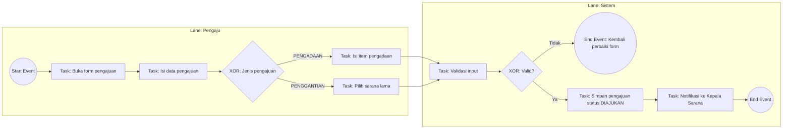
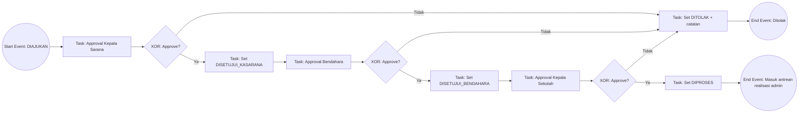
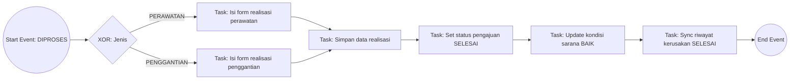
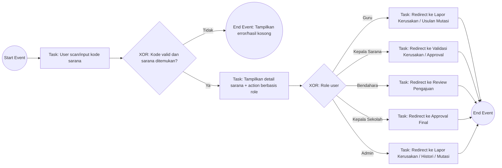
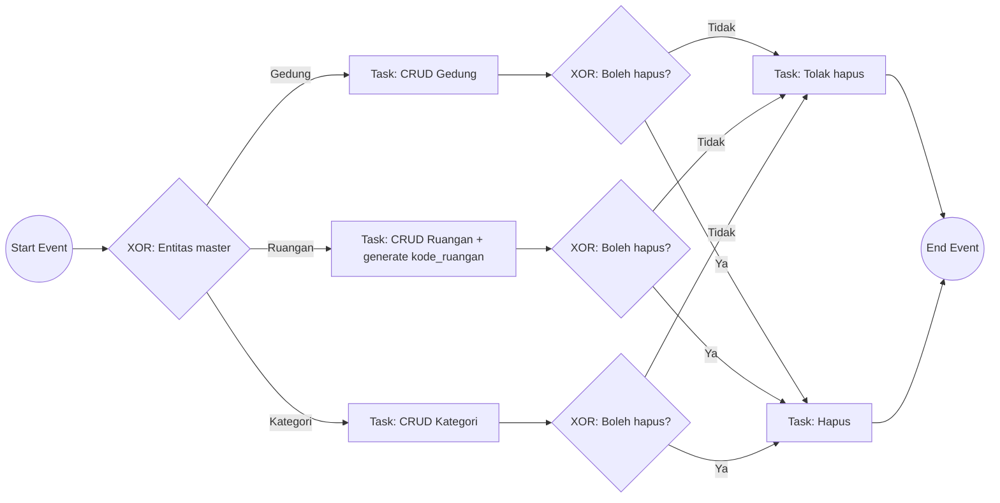
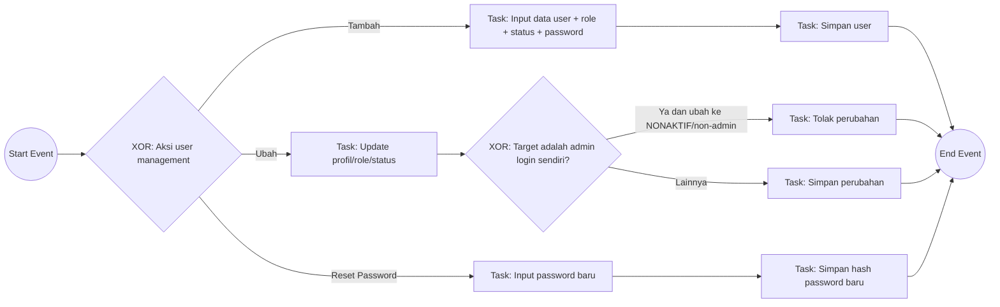
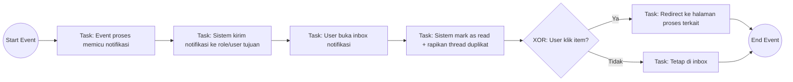
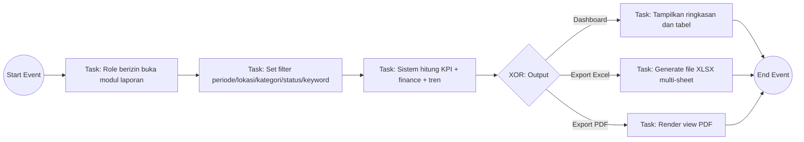

# BPMN Profesional Sistem Sarpras (As-Is)

Dokumen ini adalah BPMN **as-is** (kondisi sistem saat ini di kode), disusun dengan gaya profesional untuk kebutuhan laporan/skripsi.

## Konvensi
- `Start Event` / `End Event` = awal/akhir proses.
- `Task` = aktivitas oleh aktor/sistem.
- `Exclusive Gateway (XOR)` = keputusan ya/tidak.
- `Lane` = pemisahan tanggung jawab aktor.

## 1) BPMN Inti: Siklus Kerusakan -> Pengajuan -> Approval -> Realisasi

```mermaid
flowchart LR
  %% Lanes
  subgraph L1[Lane: Pelapor (Guru/Admin/Kepala Sarana/Bendahara/Kepala Sekolah)]
    A((Start Event)) --> B[Task: Input laporan kerusakan]
  end

  subgraph L2[Lane: Sistem]
    B --> C{XOR: Ada laporan aktif untuk sarana?}
    C -- Ya --> C1[End Event: Laporan ditolak sistem]
    C -- Tidak --> D[Task: Simpan riwayat status DILAPORKAN]
    D --> E{XOR: Pelapor adalah Kepala Sarana?}
  end

  subgraph L3[Lane: Validator]
    E -- Ya --> F1[Task: Kepala Sekolah validasi]
    E -- Tidak --> F2[Task: Kepala Sarana validasi]
    F1 --> G{XOR: Aksi TOLAK?}
    F2 --> G
    G -- Ya --> H[Task: Set riwayat DITOLAK + catatan]
    G -- Tidak --> I[Task: Input rekomendasi dan estimasi]
  end

  subgraph L2b[Lane: Sistem]
    I --> J[Task: Set riwayat DIVALIDASI]
    J --> K[Task: Update kondisi sarana sesuai tingkat kerusakan]
    K --> L[Task: Auto-create pengajuan]
    L --> M[Task: Set status pengajuan DISETUJUI_KASARANA]
    M --> N{XOR: Validator = Kepala Sarana?}
    N -- Ya --> O[Task: Simpan approval KASARANA]
    N -- Tidak --> P[Task: Lewati approval KASARANA]
    O --> Q[Task: Kirim notifikasi ke Bendahara]
    P --> Q
  end

  subgraph L4[Lane: Bendahara]
    Q --> R[Task: Review pengajuan]
    R --> S{XOR: Approve?}
    S -- Tidak --> T[Task: Tolak pengajuan]
    S -- Ya --> U[Task: Approve anggaran]
  end

  subgraph L2c[Lane: Sistem]
    U --> V[Task: Set status DISETUJUI_BENDAHARA]
    T --> T1[Task: Set status DITOLAK]
  end

  subgraph L5[Lane: Kepala Sekolah]
    V --> W[Task: Approval final]
    W --> X{XOR: Approve?}
    X -- Tidak --> Y[Task: Tolak pengajuan]
    X -- Ya --> Z[Task: Setujui final]
  end

  subgraph L2d[Lane: Sistem]
    Z --> AA[Task: Set status DIPROSES]
    Y --> Y1[Task: Set status DITOLAK]
  end

  subgraph L6[Lane: Admin]
    AA --> AB[Task: Input realisasi perawatan/penggantian]
  end

  subgraph L2e[Lane: Sistem]
    AB --> AC[Task: Simpan realisasi]
    AC --> AD[Task: Set status pengajuan SELESAI]
    AD --> AE[Task: Update kondisi sarana BAIK]
    AE --> AF[Task: Sync riwayat kerusakan SELESAI]
    AF --> AG((End Event: Proses selesai))
    H --> AH((End Event: Laporan kerusakan ditolak))
    T1 --> AI((End Event: Pengajuan ditolak di bendahara))
    Y1 --> AJ((End Event: Pengajuan ditolak di kepala sekolah))
  end
```

## 2) BPMN Pengajuan Manual (Tanpa Berasal dari Kerusakan)



## 3) BPMN Approval Bertingkat (Formal)



## 4) BPMN Realisasi Admin (As-Is Kode)



## 5) BPMN Scan QR Action Hub



## 6) BPMN Inventaris Sarana (Admin)

```mermaid
flowchart LR
  A((Start Event)) --> B{XOR: Mode kelola sarana}
  B -- Create Unit --> C[Task: Input 1 sarana]
  B -- Create Batch --> D[Task: Input per ruangan/per kategori/import]
  B -- Edit --> E[Task: Ubah data sarana]
  B -- Delete --> F[Task: Hapus sarana]

  C --> G[Task: Generate kode_sarana + nama_sarana]
  D --> G
  G --> H[Task: Simpan sarana]
  E --> I[Task: Simpan perubahan]
  F --> J{XOR: Sarana punya relasi proses?}
  J -- Ya --> K[Task: Soft delete (arsip)]
  J -- Tidak --> L[Task: Hard delete + hapus foto]

  H --> M((End Event))
  I --> M
  K --> M
  L --> M
```

## 7) BPMN Master Data (Gedung, Ruangan, Kategori)



## 8) BPMN Manajemen User (Admin)



## 9) BPMN Notifikasi



## 10) BPMN Pelaporan dan Export



---

## Catatan Profesional (As-Is vs To-Be)
- Pada kode saat ini, setelah realisasi admin, status langsung `SELESAI`.
- Node status `MENUNGGU_VERIFIKASI_TEKNIS/KEUANGAN` tetap ada di sistem, namun dipakai bila alur verifikasi diaktifkan pada proses tertentu.
- Jika kamu butuh versi **To-Be** (misalnya verifikasi teknis/keuangan wajib sebelum selesai), saya bisa buatkan paket BPMN terpisah `AS-IS` dan `TO-BE`.

