# BPMN Profesional Sistem SARPRAS SMKNIS

Versi: 2.0  
Tanggal: Juni 2026  
Status: As-Is, sesuai alur aplikasi saat ini  
Format: BPMN-style swimlane menggunakan Mermaid agar mudah dibaca di Markdown

Dokumen ini memetakan proses bisnis utama Sistem Manajemen Sarana Prasarana
SMKNIS berdasarkan route, controller, model status, dan role yang ada di sistem.

---

## 1. Aktor dan Tanggung Jawab

| Aktor | Tanggung Jawab Utama | Modul Terkait |
| --- | --- | --- |
| Guru/Staf | Scan QR, lapor kerusakan, buat pengajuan, pantau status | Scan QR, Kerusakan, Pengajuan, Notifikasi |
| Kepala Sarana | Validasi kerusakan, approval teknis, monitoring aset dan proses | Kerusakan, Pengajuan, Aset, Laporan |
| Bendahara | Review seluruh pengajuan, approval anggaran, verifikasi keuangan | Pengajuan, Laporan, Notifikasi |
| Kepala Sekolah | Approval final dan validasi khusus laporan dari Kepala Sarana | Pengajuan, Kerusakan, Laporan |
| Admin | Kelola aset, master data, user, QR, realisasi perawatan/penggantian | Inventaris, Master Data, User, Realisasi |
| Sistem | Validasi data, update status, simpan riwayat, kirim notifikasi | Semua modul |

---

## 2. Peta Modul Sistem

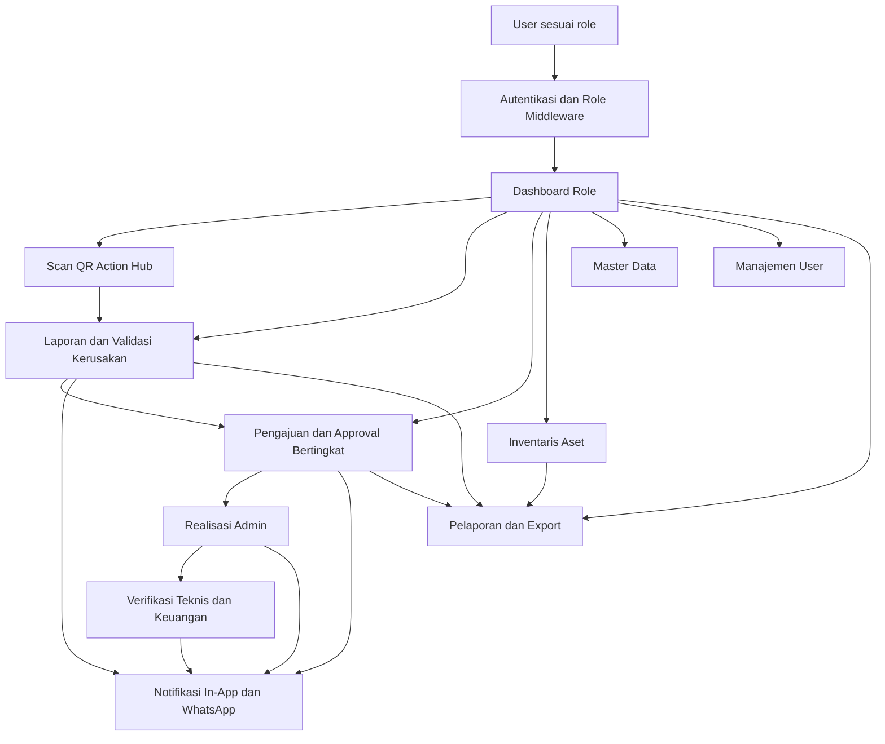

---

## 3. BPMN Utama: Kerusakan Aset sampai Selesai

Alur ini digunakan ketika user melaporkan kerusakan aset. Validasi kerusakan akan
membuat pengajuan otomatis untuk `PERAWATAN` atau `PENGGANTIAN`.

Catatan penting:

- Jika pelapor adalah Kepala Sarana, validator kerusakan adalah Kepala Sekolah.
- Jika pelapor selain Kepala Sarana, validator kerusakan adalah Kepala Sarana.
- Setelah validasi kerusakan oleh Kepala Sarana, pengajuan otomatis langsung masuk status `DISETUJUI_KASARANA`, sehingga tahap berikutnya adalah Bendahara.
- Pengajuan selesai setelah realisasi admin dan, jika diperlukan, verifikasi teknis/keuangan.

```mermaid
flowchart TD
    Start((Start: aset rusak))

    subgraph Pelapor["Lane: Pelapor"]
        A1[Scan QR atau pilih aset manual]
        A2[Isi tingkat kerusakan, deskripsi, dan foto]
        A3[Kirim laporan kerusakan]
    end

    subgraph Sistem1["Lane: Sistem"]
        B1{Ada laporan aktif untuk aset?}
        B2[Tolak input duplikat]
        B3[Simpan riwayat kondisi: DILAPORKAN]
        B4[Kirim notifikasi ke validator]
    end

    subgraph Validator["Lane: Kepala Sarana / Kepala Sekolah"]
        C1[Review laporan dan foto kerusakan]
        C2{Laporan valid?}
        C3[Isi catatan penolakan]
        C4[Tentukan tingkat kerusakan]
        C5[Pilih rekomendasi: PERAWATAN atau PENGGANTIAN]
        C6[Isi estimasi biaya]
        C7[Validasi kerusakan]
    end

    subgraph Sistem2["Lane: Sistem"]
        D1[Update riwayat: DIVALIDASI]
        D2[Update kondisi aset]
        D3[Buat pengajuan otomatis]
        D4[Set status pengajuan: DISETUJUI_KASARANA]
        D5[Buat approval Kepala Sarana jika validator Kepala Sarana]
        D6[Notifikasi Bendahara]
        D7[Set riwayat: DITOLAK]
        D8[Notifikasi pelapor]
    end

    subgraph Bendahara["Lane: Bendahara"]
        E1[Review pengajuan dan estimasi biaya]
        E2{Anggaran disetujui?}
        E3[Approve anggaran]
        E4[Tolak dengan catatan]
    end

    subgraph Sistem3["Lane: Sistem"]
        F1[Set status: DISETUJUI_BENDAHARA]
        F2[Notifikasi Kepala Sekolah]
        F3[Set status: DITOLAK]
        F4[Notifikasi pengaju]
    end

    subgraph Kepsek["Lane: Kepala Sekolah"]
        G1[Review final pengajuan]
        G2{Disetujui final?}
        G3[Approve final]
        G4[Tolak dengan catatan]
    end

    subgraph Sistem4["Lane: Sistem"]
        H1[Set status: DIPROSES]
        H2[Notifikasi Admin untuk realisasi]
        H3[Set status: DITOLAK]
        H4[Notifikasi pengaju]
    end

    subgraph Admin["Lane: Admin"]
        I1[Buka antrean realisasi]
        I2{Jenis pengajuan?}
        I3[Input realisasi perawatan]
        I4[Input realisasi penggantian dan aset baru]
        I5[Simpan realisasi]
    end

    subgraph Sistem5["Lane: Sistem"]
        J1[Simpan data perawatan/penggantian]
        J2[Set status: SELESAI]
        J3[Update kondisi aset: BAIK]
        J4[Sinkronkan status kerusakan: SELESAI]
        J5[Notifikasi selesai]
    end

    EndOk((End: selesai))
    EndDup((End: duplikat))
    EndReject1((End: laporan ditolak))
    EndReject2((End: pengajuan ditolak))

    Start --> A1 --> A2 --> A3 --> B1
    B1 -->|Ya| B2 --> EndDup
    B1 -->|Tidak| B3 --> B4 --> C1 --> C2
    C2 -->|Tidak| C3 --> D7 --> D8 --> EndReject1
    C2 -->|Ya| C4 --> C5 --> C6 --> C7 --> D1 --> D2 --> D3 --> D4 --> D5 --> D6
    D6 --> E1 --> E2
    E2 -->|Tidak| E4 --> F3 --> F4 --> EndReject2
    E2 -->|Ya| E3 --> F1 --> F2 --> G1 --> G2
    G2 -->|Tidak| G4 --> H3 --> H4 --> EndReject2
    G2 -->|Ya| G3 --> H1 --> H2 --> I1 --> I2
    I2 -->|PERAWATAN| I3 --> I5
    I2 -->|PENGGANTIAN| I4 --> I5
    I5 --> J1 --> J2 --> J3 --> J4 --> J5 --> EndOk
```

---

## 4. BPMN: Pengajuan Manual

Alur ini digunakan saat user membuat pengajuan tanpa melalui laporan kerusakan.
Sesuai controller saat ini, jenis pengajuan manual yang aktif adalah `PENGADAAN`
dan `PENGGANTIAN`.

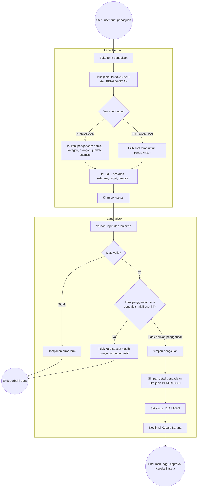

---

## 5. BPMN: Approval Bertingkat Pengajuan

Status aktual yang dipakai sistem:

1. `DIAJUKAN`
2. `DISETUJUI_KASARANA`
3. `DISETUJUI_BENDAHARA`
4. `DIPROSES`
5. `MENUNGGU_VERIFIKASI_TEKNIS`
6. `MENUNGGU_VERIFIKASI_KEUANGAN`
7. `SELESAI`
8. `DITOLAK`

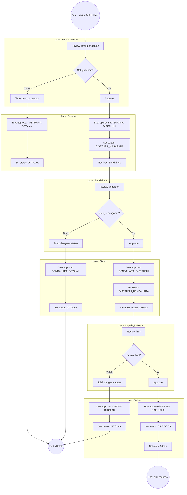

---

## 6. BPMN: Realisasi dan Verifikasi Akhir

Admin merealisasikan pengajuan `PERAWATAN` atau `PENGGANTIAN`. Setelah realisasi,
sistem menyimpan data realisasi dan mengarah ke penyelesaian. Sistem juga
menyediakan tahap verifikasi teknis dan keuangan untuk status yang memerlukannya.

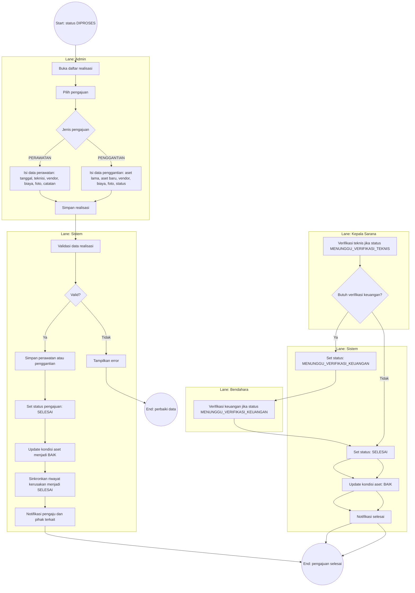

---

## 7. BPMN: Scan QR Action Hub

Scan QR menjadi titik awal cepat untuk mencari aset dan mengarahkan user ke aksi
sesuai role.

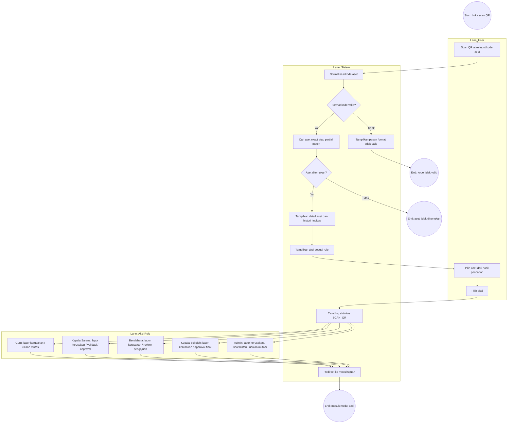

---

## 8. BPMN: Manajemen Inventaris Aset

Modul ini hanya untuk Admin. Data aset dapat dibuat satuan, batch per ruangan,
batch per kategori, import massal, edit, arsip, atau hapus permanen.

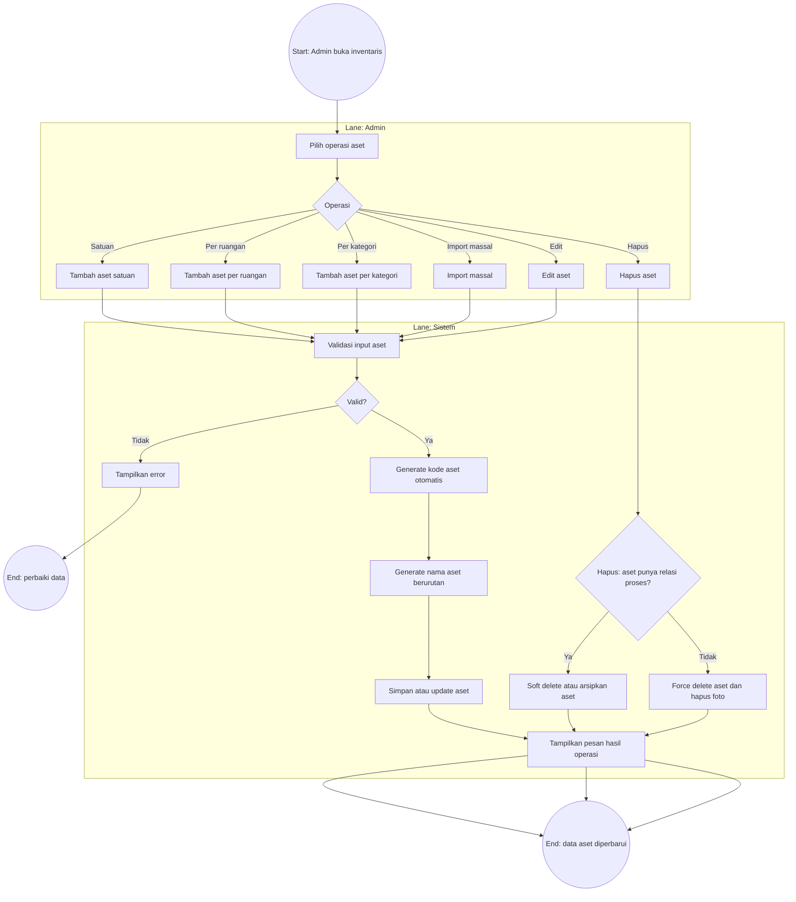

---

## 9. BPMN: Master Data dan Manajemen User

Master data meliputi gedung, ruangan, dan kategori aset. Manajemen user meliputi
tambah user, update user, hapus user, dan reset password.

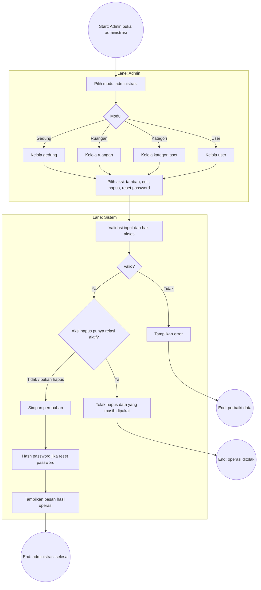

---

## 10. BPMN: Notifikasi

Notifikasi dibuat dari perubahan penting seperti laporan kerusakan, validasi,
approval, penolakan, realisasi, dan verifikasi. Sistem menyimpan notifikasi di
database dan mengirim WhatsApp ke user tujuan.

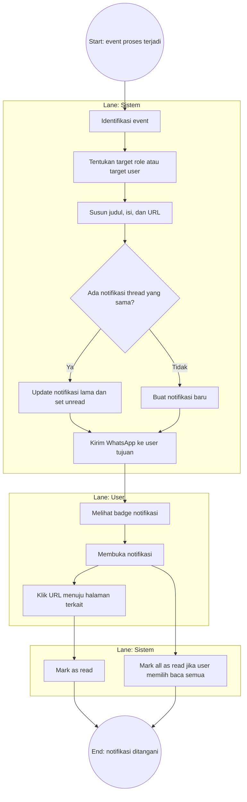

---

## 11. BPMN: Pelaporan dan Export

Modul laporan tersedia untuk Admin, Kepala Sarana, Bendahara, dan Kepala Sekolah.
Guru tidak memiliki akses laporan.

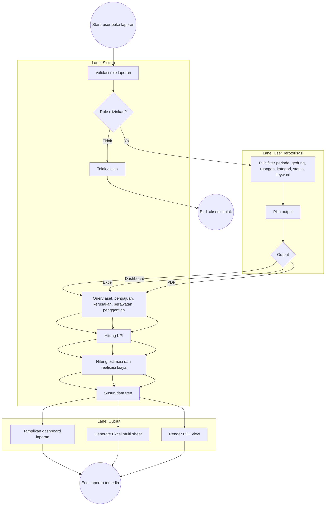

---

## 12. Aturan Bisnis Penting

### 12.1 Status Pengajuan

| Status | Makna | Pemilik Aksi Berikutnya |
| --- | --- | --- |
| `DIAJUKAN` | Pengajuan baru menunggu approval teknis | Kepala Sarana |
| `DISETUJUI_KASARANA` | Approval teknis selesai, menunggu anggaran | Bendahara |
| `DISETUJUI_BENDAHARA` | Approval anggaran selesai, menunggu final | Kepala Sekolah |
| `DISETUJUI_KEPSEK` | Status final lama yang masih dikenali sistem | Admin |
| `DIPROSES` | Pengajuan siap/sedang direalisasikan | Admin |
| `MENUNGGU_VERIFIKASI_TEKNIS` | Realisasi perlu verifikasi teknis | Kepala Sarana |
| `MENUNGGU_VERIFIKASI_KEUANGAN` | Realisasi perlu verifikasi biaya | Bendahara |
| `SELESAI` | Proses selesai | Tidak ada |
| `DITOLAK` | Pengajuan ditolak di salah satu approval | Tidak ada |

### 12.2 Status Kerusakan

| Status | Makna | Pemilik Aksi Berikutnya |
| --- | --- | --- |
| `DILAPORKAN` | Laporan baru masuk | Kepala Sarana atau Kepala Sekolah |
| `DIVALIDASI` | Laporan valid dan pengajuan otomatis dibuat | Sistem / Pengajuan |
| `DITINDAKLANJUTI` | Kerusakan sedang ditangani | Admin / Verifikator |
| `SELESAI` | Kerusakan selesai ditangani | Tidak ada |
| `DITOLAK` | Laporan kerusakan ditolak | Tidak ada |

### 12.3 Kondisi Aset

| Kondisi | Makna |
| --- | --- |
| `BAIK` | Aset normal dan dapat digunakan |
| `RINGAN` | Rusak ringan, umumnya direkomendasikan perawatan |
| `BERAT` | Rusak berat, dapat memerlukan penggantian |
| `TIDAK_LAYAK` | Aset tidak layak digunakan |

### 12.4 Aturan Validasi Kunci

| Aturan | Dampak |
| --- | --- |
| Satu aset tidak boleh punya laporan kerusakan aktif ganda | Sistem menolak laporan baru |
| Satu aset tidak boleh punya pengajuan penggantian aktif ganda | Sistem menolak pengajuan baru |
| Approval harus sesuai urutan role | Role yang salah ditolak |
| Pengaju tidak boleh meng-approve pengajuan sendiri | Anti self-approval |
| Aset yang sudah punya relasi proses tidak dihapus permanen | Sistem mengarsipkan aset |
| Laporan hanya bisa diakses role tertentu | Guru tidak bisa membuka modul laporan |

---

## 13. Ringkasan Alur End-to-End

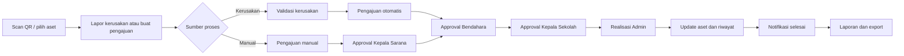

---

## 14. Rekomendasi Penggunaan Dokumen

1. Gunakan Bab 3 sebagai BPMN utama untuk presentasi sistem.
2. Gunakan Bab 4 dan Bab 5 untuk menjelaskan pengajuan dan approval.
3. Gunakan Bab 6 untuk menjelaskan penyelesaian pekerjaan admin.
4. Gunakan Bab 12 sebagai referensi status ketika membuat SOP atau manual user.
5. Jika diagram akan dimasukkan ke Word/Canva, render Mermaid menjadi gambar PNG/SVG.

